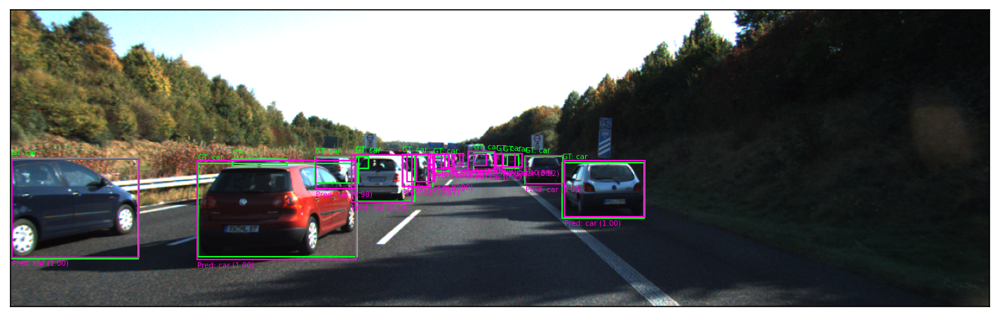

# Session 1 - Object Detection

## Contents
- [Introduction](#introduction)
- [Quick Set-Up](#quick-set-up)
- [Datasets and Metrics](#datasets-and-metrics)
- [Running Inference with Pre-Trained Models (Task C)](#running-inference-with-pre-trained-models-task-c)
- [Evaluating Pre-Trained Models (Task D)](#evaluating-pre-trained-models-task-d)
- [Fine-Tuning the Models on KITTI-MOTS (Task E)](#fine-tuning-the-models-on-kitti-mots-task-e)
- [Fine-Tuning on Chest X-Ray Dataset (Domain Shift) (Task F)](#fine-tuning-on-chest-x-ray-dataset-domain-shift-task-f)


## Introduction

In this Session we experiment with different object detection architectures. In particular, we work with three different models from three different frameworks:
- Faster R-CNN from [Detectron2](https://ai.meta.com/tools/detectron2/)
- DETR from [Hugging Face](https://huggingface.co/)
- YOLO from [Ultralytics](https://www.ultralytics.com/)

For each of these architectures, we do the following:
- Perform inference without fine-tuning.
- Fine-tune on a specific dataset.
- Extract qualitative and quantitative results, comparing them.

Additionally, we:
- Fine-tune on a domain shifted dataset.
- Globally compare the different architectures.

The models are pre-trained on the COCO dataset, and the dataset we use for inference and fine-tuning is the KITTI-MOTS. The domain shifted dataset is the Chest X-Ray dataset from Hugging Face. For evaluation, we use the official COCO metrics. More information about the dataset and metrics in Section [Datasets and Metrics](#datasets-and-metrics).


## Quick Set-Up

To perform the experiments, we assume the KITTI-MOTS dataset is structured as follows:

```
.
└── KITTI-MOTS/
    ├── instances_txt/
    │   ├── 0000.txt
    │   ├── 0001.txt
    │   └── ...
    └── training/
        └── image_02/
            ├── 0000/
            │   ├── 000000.png
            │   ├── 000001.png
            │   └── ...
            ├── 0001/
            │   ├── 000000.png
            │   ├── 000001.png
            │   └── ...
            └── ...
```

Regarding the scripts, they are all in Python. We have performed experiments separately for each differen architecture/framework. Thus, we specify next three different set-ups:

### Running Faster R-CNN (Detectron2) experiments

The scripts related to Faster R-CNN are in the `/detectron` folder and are the following:
TO DO
TO DO
TO DO

### Running DETR (Hugging Face) experiments

The scripts related to DETR are in the `/detr` folder and are the following:
- `inference_DETR.py`: performs inference without fine tuning + plots prediction examples + calculates COCO metrics.
- `finetune_DETR.py`: fine-tunes DETR to coco and saves the model.
- `eval_finetune_DETR.py`: with the saved fine-tuned model, plots prediction examples + calculates COCO metrics.
- `utils.py`: utilities for the previous DETR scripts.
- `requirements.txt`: pip requirements to execute the DETR scripts.

The scripts don't require any arguments and can be executed directly with `python <script>.py`. More information about the scripts in the following sections.

### Running YOLO (Ultralytics) experiments

The scripts related to YOLO are in the `/huggingface` folder and are the following:
TO DO
TO DO
TO DO


## Datasets and Metrics

In this Session there are three datasets involved:
- [**COCO (Common Objects in Context)**](https://cocodataset.org/): It's the dataset the models we use are pre-trained with. It's is a widely used large-scale dataset for object detection, segmentation, keypoint detection, and image captioning. It contains over 330,000 images, with 1.5 million object instances spanning 80 object categories.
- [**KITTI-MOTS**](https://www.cvlibs.net/datasets/kitti/): It's the dataset we use for inference and fine-tuning. It's an extension of the KITTI dataset, designed for multi-object tracking and segmentation (MOTS) in autonomous driving scenarios. It provides instance-level segmentation masks for cars and pedestrians across 2,000 frames from real-world street scenes. We only use the official training partition, sub-dividing it in our own train and test sets (sequences 0-15 and 16-20, respectively).
- [**Chest X-Ray**](https://huggingface.co/datasets/Tsomaros/Chest_Xray_N_Object_Detection): It's the dataset we use for fine-tuning with domain shift. It features different conditions, containing 8 different classes to detect. Only has one bounding box per image, and the train split (that we use) contains 880 images.

The metrics that we use are the official COCO metrics:
- **AP**: AP at IoU=50:05:95  
- **AP<sub>IoU=.50</sub>**: AP at IoU=0.50  
- **AP<sub>IoU=.75</sub>**: AP at IoU=0.75  
- **AP<sub>small</sub>**: AP for small objects (area < 32²)  
- **AP<sub>medium</sub>**: AP for medium objects (32² < area < 96²)  
- **AP<sub>large</sub>**: AP for large objects (area > 96²)  
- **AR<sub>max=1</sub>**: AR for 1 detection per image  
- **AR<sub>max=10</sub>**: AR for 10 detections per image  
- **AR<sub>max=100</sub>**: AR for 100 detections per image  
- **AR<sub>small</sub>**: AR for small objects (area < 32²)  
- **AR<sub>medium</sub>**: AR for medium objects (32² < area < 96²)  
- **AR<sub>large</sub>**: AR for large objects (area > 96²)

We calculate them using the `COCOeval()` function from the `pycocotools` library.

## Running Inference with Pre-Trained Models (Task C)

### Faster R-CNN from Detectron2

TO DO
TO DO
TO DO

### DETR from Hugging Face

For this task, first we load the pre-trained DETR model “facebook/detr-resnet-50” from Hugging Face, along with the corresponding image processor. Then, we preprocess the test data with a custom PyTorch DataLoader, which uses a tailored collate function and the image processor. We then loop over the dataset, filtering and matching COCO to KITTI-MOTS classes. This is encapsulated in the `inference_DETR.py` script, which also plots some example prediction images, and calculates the official COCO metrics. Results are saved to the folder `/results_detr_kittimots_inference`, which is created automatically if it doesn't exist.

Here's an example inference image:


### YOLO from Ultralytics

TO DO
TO DO
TO DO


## Evaluating Pre-Trained Models (Task D)

### Faster R-CNN from Detectron2

TO DO
TO DO
TO DO

### DETR from Hugging Face

To evaluate the pre-trained DETR model, we gather the groundtruth and predictions during the evaluation loop in the correct format. We map categories so all labels are KITTI-MOTS, and convert all bounding boxes to the COCO format, compatible with the evaluation library we use. Again, here we use the `inference_DETR.py`, which saves the metrics in the `coco_metrics.csv` file, inside the automatically generated `/results_detr_kittimots_inference` folder.

The next table shows the official COCO metrics:
| AP  | AP<sub>50</sub> | AP<sub>75</sub> | AP<sub>S</sub> | AP<sub>M</sub> | AP<sub>L</sub> | AR<sub>1</sub> | AR<sub>10</sub> | AR<sub>100</sub> | AR<sub>S</sub> | AR<sub>M</sub> | AR<sub>L</sub> |
|-----|-----------------|-----------------|----------------|----------------|----------------|----------------|-----------------|------------------|--------------------|---------------------|--------------------|
|49.5 |77.8             |53.7             |18.0            |51.1            |75.2            |14.9           |56.2            |59.3             |33.5               |60.9                |83.3               |

### YOLO from Ultralytics

TO DO
TO DO
TO DO


## Fine-Tuning the Models on KITTI-MOTS (Task E)

### Faster R-CNN from Detectron2

TO DO
TO DO
TO DO

### DETR from Hugging Face

To fine-tune DETR to KITTI-MOTS, first we initialize the `facebook/detr-resnet-50` model from Hugging Face with a custom, 2-label map: `{0: "car", 1: "pedestrian"}`, changing the classification head. Then, we create a custom DataLoader to preprocess the data to match the label map and apply augmentations. This is encapsulated in the `finetune_DETR.py` script.

We train the model for 30 epochs with early stopping and with the Trainer and TrainingArguments functions from Hugging Face. We performed 5 different fine-tuning executions:
- Baseline execution with some default arguments (see our GitHub for details).
- With a set of Albumentations (see explanation below).
- Changing the learning rate (from 1e5 to 3e5), no Albumentations.
- Changing the image size (from 480x600 to 600x800), no Albumentations.
- Changing the image size (from 480x600 to full size of 800x1333) + Albumentations.

To obtain the qualitative and quantitative metrics, we can run the `eval_finetune_DETR.py` script. This scripts saves the visualizations and the metrics inside the `/results_detr_kittimots_finetuning` folder, which is created automatically if it doesn't exist.

The next table shows the official COCO metrics for the different experiments:
| Execution    | AP     | AP<sub>50</sub> | AP<sub>75</sub> | AP<sub>S</sub> | AP<sub>M</sub> | AP<sub>L</sub> | AR<sub>1</sub> | AR<sub>10</sub> | AR<sub>100</sub> | AR<sub>S</sub> | AR<sub>M</sub> | AR<sub>L</sub> |
|--------------|--------|-----------------|-----------------|----------------|----------------|----------------|----------------|-----------------|------------------|----------------|----------------|----------------|
| FT Base      | 33.3   | 61.0            | 31.7            | 8.07           | 31.4           | 65.7           | 12.2           | 41.4            | 44.8             | 14.3           | 45.7           | 76.0           |
| FT + Aug     | 37.9   | 65.2            | 37.4            | 9.46           | 36.5           | 70.3           | 13.8           | 44.0            | 46.4             | 15.0           | 47.4           | 78.6           |
| FT ↑LR       | 30.5   | 63.8            | 24.2            | 5.57           | 28.2           | 65.2           | 11.3           | 37.0            | 37.9             | 10.5           | 36.5           | 72.2           |
| FT ↑Size     | 43.7   | 71.5            | 44.9            | 12.8           | 45.1           | 73.9           | 14.3           | 50.4            | 51.6             | 20.4           | 53.6           | 80.9           |
| FT ↑↑S. + A. | -      | -               | -               | -              | -              | -              | -              | -               | -                | -              | -              | -              |


### YOLO from Ultralytics

TO DO
TO DO
TO DO


## Fine-Tuning on Chest X-Ray Dataset (Domain Shift) (Task F)

TO DO
TO DO
TO DO


