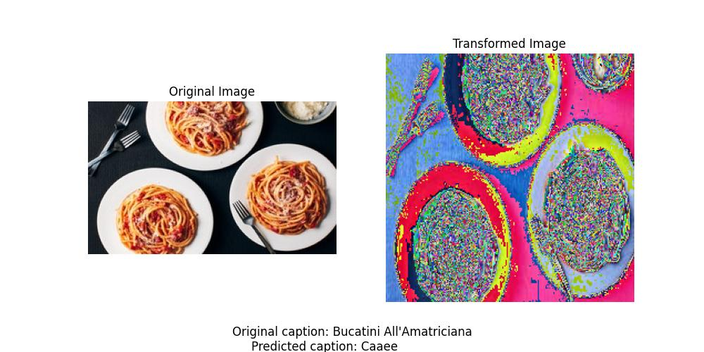

# Session 3 - Image Captioning (1)

Project Presentation Link: [.](.)

## Contents
- [Introduction](#introduction)
- [Quick Set-Up](#quick-set-up)
- [Datasets and Metrics](#datasets-and-metrics)
- [Image Captioning Examples](#image-captioning-examples)

## Introduction

In this Session, we experiment with different **image captioning** architectures. In particular, we experiment with different encoders:
- ResNet-18
- ResNet-34
- ResNet-50
- VGG-16
- VGG-19

With different decoders:
- GRU
- LSTM
- xLSTM

And with different text representations:
- Character-level
- Wordpiece-level
- Word-level

Additionally, we also experiment Bahdanau attention, as well as other techniques such as teacher forcing, learning rate decay, early stopping, etc, to enhance performance.

The encoder models are pre-trained, and then we train on the Food Ingredients and Recipes Dataset with Images from Kaggle (more information in Section [Datasets and Metrics](#datasets-and-metrics)).

## Quick Set-Up

To perform the experiments, we assume the dataset is already preprocessed with the preprocessing scripts (see below), and split in `clean_mapping_train.csv`, `clean_mapping_validation.csv`, and `clean_mapping_test.csv`.

### Running the preprocessing scripts

Once the raw data downloaded, execute the preprocessing script as `python preprocess_mapping.py --base-path --input-csv --output-csv` to generate the clean version of the csv mapping. Then, to the clean mapping, apply the splitting script as `python split_mapping.py <file_path>`. This will produce three files, `<clean_mapping>_train.csv`, `<clean_mapping>_validation.csv`, and `<clean_mapping>_test.csv` corresponding to the 80-10-10 train-validation-test split, and that can be directly used with the training and evaluation scripts.

### General execution script
Once the data is preprocessed we can proceed and execute the different models we have. All this execution is distributed across different files, there is the `train_custom.py` which is the script for training loop, the `test_model.py` that contains script for the test and then the `utils` folder that contains miscelaneous files. In the `utils` folder we have a `configuration.py` that contains the diferent parameters like the batch size , paths that will be used in the scripts or the tokenizer modes; in the `models.py` there are the different models; in the `utils.py` there are miscelanious classes and functions like the dataset loader or the tokenizer; and on the `visualization.py` there are the different plot functions.

#### Running the baseline training and evaluation
To execute the baseline model, you have to instantiate it as `Model` and the required arguments, this will do the basic model that was given to us.
#### Running a custom architecture training and evaluation
* Custom Model: this one is called as `ModelCustom`, has similar arguments as `Model` but you can also specify which encoder and which decoder you want to use. 
* Custom Model with Attention: this model implements an attention mecanism to the `ModelCustom`and can be instantiated as `ModelWithAttention` this one needs the tokenizer as an argument, and also has the selection of different encoders and decoders.

## Datasets and Metrics

In this Session, there is only one dataset involved, the [**Food Ingredients and Recipes Dataset with Images**](https://www.kaggle.com/datasets/pes12017000148/food-ingredients-and-recipe-dataset-with-images) from Kaggle. The dataset consists of 13,582 images featuring different dishes, and a `.csv` file mapping images to ground-truth captions.

Next, we show and intuitively explain the metrics that we use for evaluation:
- **BLEU-1**: Measures the precision of unigrams (single words) between the generated and reference captions.  
- **BLEU-2**: Measures the precision of bigrams (two-word sequences) for better contextual accuracy.  
- **ROUGE-L**: Evaluates the longest common subsequence (LCS) to assess similarity between generated and reference texts.  
- **METEOR**: Considers synonym matching and stemming to improve semantic similarity evaluation.  

We calculate them using the `evaluate` library from Hugging Face.

## Object Segmentation Examples

Baseline model example:

