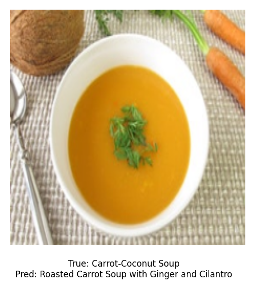

# Session 4 - Image Captioning (2)

Project Presentation Link: [.](.)

Report Overleaf Link: [https://overleaf.cvc.uab.cat/read/vjkbhjmcpbkn#aa67f6](https://overleaf.cvc.uab.cat/read/vjkbhjmcpbkn#aa67f6)


## Contents
- [Introduction](#introduction)
- [Quick Set-Up](#quick-set-up)
- [Datasets and Metrics](#datasets-and-metrics)
- [Image Captioning Examples](#image-captioning-examples)


## Introduction

In this Session, we experiment with more advanced **image captioning** architectures. On one hand, we experiment with the **ViT-GPT2** architecture, first doing direct evaluation, and then with different fine-tuning strategies:
- ViT (FT) + GPT2 (Frozen)
- ViT (Frozen) + GPT2 (FT)
- ViT (FT) + GPT2 (FT)

On the other hand, we experiment with multimodal LLMs, directly evaluating them with different prompting techniques. In particular, we evaluate the following models:
- Gemma-3-4b
- SmolVLM-256M

Finally, we also explore the ViT-Llama architecture, trying different ViTs feature extractors and fine-tuning the Llama decoders, experimenting with different hyperparameters. In particular, we use these models:
- Llama 3.2-1B
- Llama 3.2-3B

We train on the Food Ingredients and Recipes Dataset with Images from Kaggle (more information in Section [Datasets and Metrics](#datasets-and-metrics)).


## Quick Set-Up

To perform the experiments, we assume the dataset is already preprocessed with the preprocessing scripts (see below), and split in `clean_mapping_train.csv`, `clean_mapping_validation.csv`, and `clean_mapping_test.csv`.

We also assume that the correct libraries are installed (see `requirements.txt`).


### Running the preprocessing scripts

Once the raw data downloaded, execute the preprocessing script as `python preprocess_mapping.py --base-path --input-csv --output-csv` to generate the clean version of the csv mapping. Then, to the clean mapping, apply the splitting script as `python split_mapping.py <file_path>`. This will produce three files, `<clean_mapping>_train.csv`, `<clean_mapping>_validation.csv`, and `<clean_mapping>_test.csv` corresponding to the 80-10-10 train-validation-test split, and that can be directly used with the scripts.

### Running the ViT-GPT2 experiments

To run the ViT-GPT2 experiments, there are two different scripts. One is for the model evaluation, `inference_vitgpt2.py`, and the other is for doing the three fine-tuning options that exist for the model, `train_vitgpt2.py`.  Both scripts can be executed without any kind of arguments.

### Running the Gemma-3-4b and SmolVLM-256M experiments

Inference on Gemma-3-4b and SmolVLM-256M can be ran using the files `gemma_inference.py` and `smol_inference.py`, respectively. They both require the same input arguments:
```
python gemma_inference.py --csv_file ./clean_mapping_validation.csv \
                          --image_dir ./FIRD/food_images \
                          --output_csv "predictions.csv" \
                          --system_prompt "$sys_prompt" \
                          --user_prompt "$usr_prompt" \
                          --visualize True
```

### Running the ViT-Llama experiments

To run the ViT-Llama experiments, we have created two different scripts: one for fine-tuning, `finetune_llama.py`, and another one for evaluating a saved fine-tuned model `evaluate_llama.py`. These scripts can be easily executed only modifying their arguments as follows:

To execute the fine-tuning script, it can be done as in the following example:
```
python finetune_llama.py --num_epochs 6 \
                         --lora_rank 16 \
                         --lora_alpha 16 \
                         --lora_target_modules "q_proj,k_proj,v_proj" \
                         --lora_dropout 0.05 \
                         --vit_model_path "/best_model_encoder" \
                         --llama_model_path "meta-llama/Llama-3.2-3B" \
                         --lr 1e-4 \
                         --optimizer adamw \
                         --batch_size 4
```

To execute the evaluation script, it can be done as in the following example:
```
python evaluate_llama.py \
    --test_csv "./clean_mapping_validation.csv" \
    --root_dir "./FIRD" \
    --save_dir "./best_checkpoint" \
    --batch_size 4 \
    --max_text_len 64 \
    --save_visuals_interval 50 \
    --llama_model_name "meta-llama/Llama-3.2-3B" \
    --vit_model_name "./best_model_encoder"
```

## Datasets and Metrics

In this Session, there is only one dataset involved, the [**Food Ingredients and Recipes Dataset with Images**](https://www.kaggle.com/datasets/pes12017000148/food-ingredients-and-recipe-dataset-with-images) from Kaggle. The dataset consists of 13,582 images featuring different dishes, and a `.csv` file mapping images to ground-truth captions.

Next, we show and intuitively explain the metrics that we use for evaluation:
- **BLEU-1**: Measures the precision of unigrams (single words) between the generated and reference captions.  
- **BLEU-2**: Measures the precision of bigrams (two-word sequences) for better contextual accuracy.  
- **ROUGE-L**: Evaluates the longest common subsequence (LCS) to assess similarity between generated and reference texts.  
- **METEOR**: Considers synonym matching and stemming to improve semantic similarity evaluation.  

We calculate them using the `evaluate` library from Hugging Face.


## Image Captioning Examples

ViT-Llama1B example:


