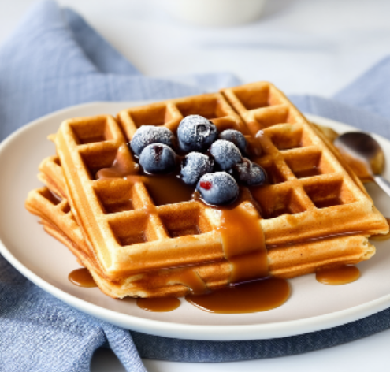

# Session 5 - Diffusion Models

Project Presentation Link: [.](.)


## Contents
- [Introduction](#introduction)
- [Quick Set-Up](#quick-set-up)
- [Datasets and Metrics](#datasets-and-metrics)
- [Stable Diffusion Food Images Examples](#stable-diffusion-food-images-examples)


## Introduction

In this Session, we examine our captioning model from last Sessions to see if we can improve their performance using generative artificial intelligence to do data augmentation. In particular, we use the following captioning architecture:
- ViT + LLaMA 3.2 1B with optimized parameters (from last Session).

Through this Session we are able to categorize our samples in 11 different dish type categories. After analyzing the mean performance by category, we identify 3 categories that we consider could benefit from more data augmentation:
- "Beverages & Drinks"
- "Baked Goods & Breads"
- "Breakfast & Brunch"

To artificially generate more data, on one hand we use a mix of ChatGPT 4o prompting and Python for the captions, and Stable Diffusion for the images. We experiment extensively with different Stable Diffusion models and try to optimize them for food generation, but we settle on two:
- Stable Diffusion 3.5 Medium (the best performing model according to our experiments).
- Stable Diffusion XL Base 1.0 (for comparison with 3.5 Medium).

Additionally, we do an in-depth analysis of our dataset to see why our data augmentation efforts provided both good and bad results.

The dataset we use throughout this Session is the Food Ingredients and Recipes Dataset with Images from Kaggle (more information in Section [Datasets and Metrics](#datasets-and-metrics)).


## Quick Set-Up

To perform the experiments, we assume the dataset is already preprocessed with the preprocessing scripts (see below), and split in `clean_mapping_train.csv`, `clean_mapping_validation.csv`, and `clean_mapping_test.csv`.

We also assume that the correct libraries are installed (see `requirements.txt`).


### Stable Diffusion Scripts

### Categorization Scripts

To classify the samples based on the captions once we have the categories, we use the `classify_captions.py` script, where we instantiate the zero-shot text classification model Bart Large MNLI, from Meta and available in Hugging Face. The script predicts the category for each sample in the given csv caption-image mapping, adding a new column for the category. Executing the script is straigthfoward and doesn't require any additional arguments.

### Model retraining

For model retraining, we slightly generalize last Session script, `finetune_llama.py`, to be able to quickly change the input training data and validation data files, so we can experiment with different Stable Diffusion models and amounts of data. An example call is the following:
```
python finetune_llama.py --num_epochs 5 \
                         --lora_rank 8 \
                         --lora_alpha 16 \
                         --lora_target_modules "q_proj,k_proj,v_proj" \
                         --lora_dropout 0.05 \
                         --vit_model_path "/ghome/c5mcv06/biel_working_dir/exps_S4/models/both/best_model_encoder" \
                         --llama_model_path "meta-llama/Llama-3.2-1B" \
                         --lr 1e-4 \
                         --optimizer adam \
                         --batch_size 4 \
                         --food_images_dir "food_images_aug_SDXL" \
                         --train_csv "mappings_aug_SDXL/clean_mapping_train_aug_100.csv" \
                         --validation_csv "mappings_aug_SDXL/clean_mapping_validation_100_processed.csv"
```
For more details on this script, please refer to past Sessions on Image Captioning.

### Further Analysis Scripts

Inside the folder `Word studying` there is an extensive exploratory data analysis in Notebook format, as well as a Python script to process the low frequency words.


## Datasets and Metrics

In this Session, there is only one dataset involved, the [**Food Ingredients and Recipes Dataset with Images**](https://www.kaggle.com/datasets/pes12017000148/food-ingredients-and-recipe-dataset-with-images) from Kaggle. The dataset consists of 13,582 images featuring different dishes, and a `.csv` file mapping images to ground-truth captions.

Next, we show and intuitively explain the metrics that we use for evaluation:
- **BLEU-1**: Measures the precision of unigrams (single words) between the generated and reference captions.  
- **BLEU-2**: Measures the precision of bigrams (two-word sequences) for better contextual accuracy.  
- **ROUGE-L**: Evaluates the longest common subsequence (LCS) to assess similarity between generated and reference texts.  
- **METEOR**: Considers synonym matching and stemming to improve semantic similarity evaluation.  

We calculate them using the `evaluate` library from Hugging Face.


## Stable Diffusion Food Images Examples

Next is an example of an image generated with Stable Diffusion 3.5 Medium (lowered resolution) for the caption "Crispy waffles with salted caramel coulis", a typical pair (food image, caption) that our model would ingest as additional artificial data.


